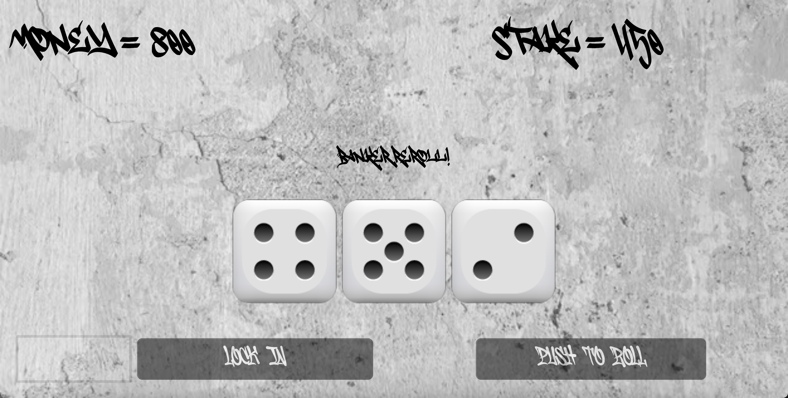

# 🎲 Ceelo Dice – React Edition

This is a browser-based version of **Cee-lo**, a fast-paced street dice game. Built with **React**, this version replicates the core gameplay with a responsive UI and local game logic.

---

## 🧠 About the Project

This version of Ceelo was created as a learning project to:

- Reimplement gameplay logic from my earlier Unity prototype
- Explore React state management and user interaction
- Prototype a responsive game UI using modern web technologies

---

## 🚀 Gameplay Screenshot

Here's a peek at the gameplay:



---

## 🛠 Tech Stack

- React + TypeScript
- CSS/JSX styling
- React hooks for state management
- No backend — fully client-side

---

## 🧪 How to Run Locally

Clone the repository and run the app:

```bash
git clone https://github.com/ianeryan17/Cee-loDiceReact.git
cd Cee-loDiceReact
npm install
npm start
```

This will run the app in development mode at http://localhost:3000.

---

## ⚙️ Available Scripts

You can run:

- npm start – Runs the app in development mode
- npm run build – Builds for production to /build
- npm test – Launches test runner

_(Adapted from Create React App)_

---

## 📁 Docs

- See CRA-README.md for the full Create React App guide.
- See /docs for screenshots or additional materials.

---

## 📄 License

MIT — Free to use with attribution
